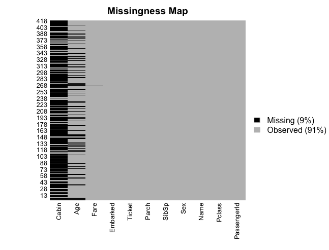
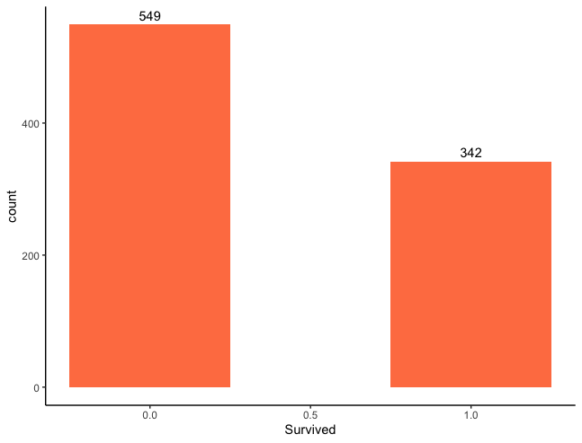
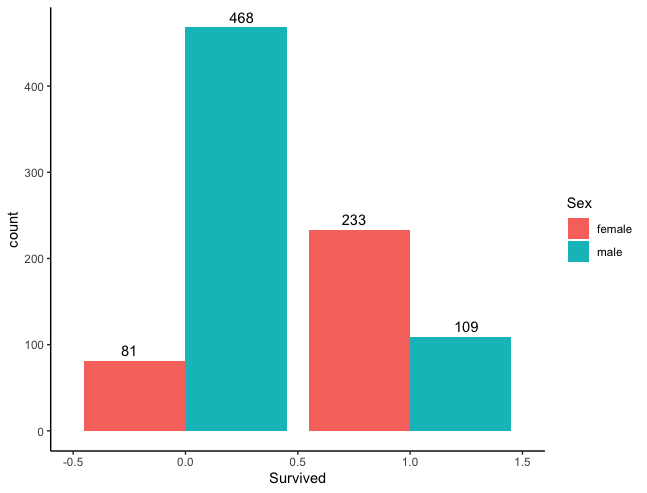
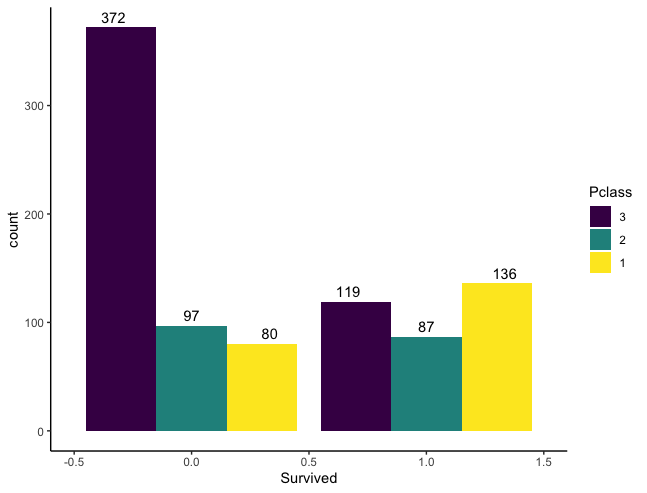
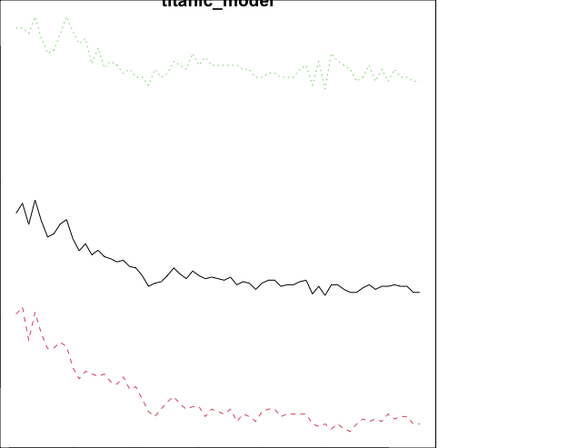
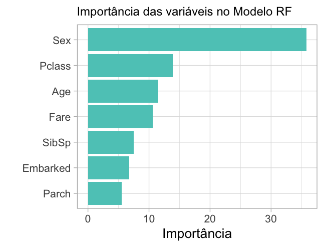

MachineLearning\_RandomForest
================
Luis Leao
4/7/2021

## Sumário

-   [Conceitos básicos sobre o modelo Floresta
    Aleatória](#Conceitos-básicos-sobre-o-modelo-Floresta-Aleatória)
    -   [Introdução](#Introdução)
    -   [Seleção de amostras](#Seleção-de-amostras)
    -   [Criando árvores e fazendo
        predição](#Criando-árvores-e-fazendo-predição)
-   [O pacote randomForest](#O-pacote-randomForest)
    -   [Instalando o pacote](#Instalando-o-pacote)
    -   [Sintaxel](#Sintaxe)
    -   [Funções básicas dentro do pacote
        randomForest](#EFunções-básicas-dentro-do-pacote-randomForest)
        -   [importance](#importance)
        -   [na.roughfix](#na-roughfix)
-   [Exemplo Machine Learning com RF aplicado ao problema
    Titanic](#Partes-que-compõem-a-aplicação)
    -   [Dados de entrada](#Dados-de-entrada)
    -   [Demonstração da aplicação](#Demonstração-da-aplicação)
-   [Referências](#Referências)

## Conceitos básicos sobre o modelo Floresta Aleatória

### Introdução

Random Forest ou Floresta Aleatória é um modelo baseado em árvores de
decisão. Este tipo de modelo é usualmente utilizado não apenas para
classificação, mas também para regressão, estudo de importância e
seleção de variáveis, e detecção de outliers.

Ele é muito usado em aplicações que requerem o aprendizado a partir de
dados, como as áreas de diagnóstico médico por imagem, predição rápida
de movimentos, análise de big data, dentre outras.

### Seleção de amostras

O primeiro passo executado pelo algoritmo o RandomForest é utilizar o
método de bootstrap para selecionar aleatoriamente algumas amostras dos
dados de treino, e não a sua totalidade.

Bootstrap é um método de reamostragem onde as amostras selecionadas
podem ser repetidas na seleção.

A primeira árvore de decisão é construída com primeira seleção de
amostras.


### Criando árvores e fazendo predição

Para definir o primeiro nó (nó raiz), o algoritmo RandomForest escolhe
de maneira aleatória (random) duas ou mais variáveis, e então, a partir
destas variáveis realiza alguns cálculos para definir qual delas será
aplicada ao primeiro nó.

Para escolha da variável do próximo nó, repete-se o mesmo processo,
excluindo as variáveis já selecionadas anteriormente. Executando-se o
mesmo processo, a árvore será construída até o último nó.

A quantidade de variáveis a serem escolhidas pode ser definida na
criação do modelo.


Como são construídas muitas árvores, com variáveis escolhidas
aleatoriamente, esse método é útil para evitar o overfitting e a
correlação entre árvores.

A construção das demais árvores, e assim da floresta, se dá através da
repetição dos processos anteriores.

Como a seleção, tanto dos subconjuntos de treino como das variáveis/nós
para cada árvore, se dá de forma aleatória a floresta será formada de
árvores “aleatoriamente” formadas.

Aumentar o número de arvores produz melhora os resultados do modelo,
contudo esta melhora é assíntota para um certo número de arvores onde
não haverá mais melhora.

Após o treinamento e aprendizagem com os dados de teste, o modelo está
criado e pode ser usado na obtenção de previsões em um novo conjunto de
dados.

O método de Random Foorest pode ser utilizado em problemas de
classificação e em problemas de regressão. Uma estimativa de erro é
feita para os casos que não foram usados durante a construção da árvore.

## O pacote randomForest

### Instalando o pacote

Use o comando abaixo no console R para instalar o pacote. Você também
deve instalar os pacotes dependentes, se houver.

-   `install.packages("randomForest)`

O pacote “randomForest” possui a função randomForest () que é usada para
criar e analisar florestas aleatórias.

### Sintaxe

A sintaxe básica para criar uma floresta aleatória em R é

-   `randomForest(formula, data, ntree, importance)`

onde

• formula é uma fórmula que descreve o preditor e as variáveis de
resposta.

• data é o nome do conjunto de dados usado.

• ntree Número de árvores a crescer. Não deve ser definido como um
número muito pequeno, para garantir que cada linha de entrada seja
prevista pelo menos algumas vezes.

• importance A importância dos preditores deve ser avaliada? True ou
False

### Funções básicas dentro do pacote randomForest

#### importance

Extrair medida de importância da variável

Uso básico

-   `importance (x, type)`

Argumentos

x: um objeto da classe randomForest. type 1 ou 2: especificando o tipo
de medida de importância (1 = diminuição média na precisão, 2 =
diminuição média na impureza do nó).

#### na.roughfix

Imputa os valores ausentes por mediana (se for num) / moda (se for
factor).

Uso básico

-   `na.roughfix (object)`

Argumentos

object: um quadro de dados ou matriz numérica.

## Exemplo Machine Learning com RF aplicado ao problema Titanic

### Dados de entrada

Usaremos o conjunto de dados Titanic da plataforma Kaggle juntamente com
o pacote randomForest. Os arquivos test.csv e train.csv são os arquivos
de teste e treino, respectivamente.

Código

``` r
#Instalar pacotes necessários
install.packages("Amelia")
install.packages("randomForest")
install.packages("ggplot2")

#Chamar os pacotes necessários
library(randomForest)
library(ggplot2)
library(Amelia)

#Importar os dados
train_set_view = read.csv("train.csv", na.strings = "")
test_set_view = read.csv("test.csv", na.strings = "")
train_set <- read.csv("train.csv", stringsAsFactors=T) 
test_set  <- read.csv("test.csv",  stringsAsFactors=T)

#Verificação e tratamento dos dados

##Check dados faltantes - Valores faltando em Cabin, Age e Fare
missmap(train_set_view, col=c("black", "grey"))
missmap(test_set_view, col=c("black", "grey"))
```



``` r
##Pessoas sobreviventes e pessoas que morreram
ggplot(train_set_view, aes(x = Survived)) +
  geom_bar(width=0.5, fill = "coral") +
  geom_text(stat='count', aes(label=stat(count)), vjust=-0.5) +
  theme_classic()
```



``` r
##Podemos inferir que um número muito menor de pessoas sobreviveu e, nessas, 
##maior número de mulheres do que de homens.
ggplot(train_set_view, aes(x = Survived, fill=Sex)) +
  geom_bar(position = position_dodge()) +
  geom_text(stat='count', 
            aes(label=stat(count)), 
            position = position_dodge(width=1), vjust=-0.5)+
  theme_classic()
```



``` r
##Podemos inferir que as chances de sobrevivência dos passageiros da 
##1ª classe foram maiores do que as demais.
train_set_view$Pclass = factor(train_set_view$Pclass, order=TRUE, levels = c(3, 2, 1))
ggplot(train_set_view, aes(x = Survived, fill=Pclass)) +
  geom_bar(position = position_dodge()) +
  geom_text(stat='count', 
            aes(label=stat(count)), 
            position = position_dodge(width=1), 
            vjust=-0.5)+theme_classic()
            
```



``` r
##Checando se há dados faltantes (variáveis ou amostras) descritiva dos 
##conjuntos
summary(train_set)
summary(test_set)

##Método alternativo para checar dados faltantes alternativamente
colSums(is.na(train_set)) 
colSums(is.na(test_set))
colSums(train_set =="")
colSums(test_set =="")

##Criar coluna faltante preenchida com NA no test_set. Originalmente não 
##há variável Survived emtest_set, pois são os os dados de teste.
test_set$Survived <- NA

##Criando uma coluna para identificar se o dado é treino ou teste e 
##Agrupando os datasets
train_set$IsTrainSet <-T
test_set$IsTrainSet  <-F
titanic_set <- rbind(train_set, test_set)

##Checando se há dados faltantes (variáveis ou amostras) descritiva do 
##conjunto titanic_set
summary(titanic_set)

##Forma alternativa de checar dados faltantes
colSums(is.na(titanic_set)) 
colSums(titanic_set =="", na.rm = TRUE)

##Transformações simples (corrigindo dados, NA num pela mediana e NA em factor
##pela moda)
titanic_set$Survived                         <- as.factor(titanic_set$Survived)
titanic_set$Pclass                           <- as.factor(titanic_set$Pclass)
titanic_set$Age[is.na(titanic_set$Age)]      <- median(titanic_set$Age, na.rm = T)
titanic_set$SibSp                            <- as.numeric(titanic_set$SibSp)
titanic_set$Parch                            <- as.numeric(titanic_set$Parch)
titanic_set$Fare[is.na(titanic_set$Fare)]    <- median(titanic_set$Fare, na.rm = T)
titanic_set$Embarked[titanic_set$Embarked==""] <-"S"
titanic_set$Embarked                         <-as.factor(as.character(titanic_set$Embarked))
table(titanic_set$Embarked)

#Construir o modelo
titanic_train <- titanic_set[titanic_set$IsTrainSet==T,]
titanic_test  <- titanic_set[titanic_set$IsTrainSet==F,]

#Criando a formula
survived_formula <- as.formula("Survived ~ Sex + Pclass + Age + SibSp + Parch + Fare + Embarked")

#Criando o modelo nos dados de treino com 65 árvores e gerando importância
titanic_model <- randomForest(formula = survived_formula,
                              data = titanic_train,
                              ntree = 65,
                              importance = T)

#Interpretando resultados
titanic_model

#Mostrando graficos curva. Saturação do numero de Árvores
plot(titanic_model)
```



``` r

#Gerando a matriz de importância das variáveis
importance_var   <- importance(titanic_model, type=1)

importance_var

#Dando uma formatada na tabela
tabela_de_importancia <- data.frame(variaveis=row.names(importance_var), 
                                    importancia=importance_var[,1]);
tabela_de_importancia


#Gerando o grafico
grafico <- ggplot(tabela_de_importancia, 
                  aes(x=reorder(variaveis,importancia), y=importance_var)) +
  geom_bar(stat="identity", fill="#5cc9c1") +
  coord_flip() + 
  theme_light(base_size=20) +
  xlab("") +
  ylab("Importância") + 
  ggtitle("Importância das variáveis no Modelo RF") +
  theme(plot.title=element_text(size=18))
grafico
```



``` r
#Preparando predição e gerando arquivo

##Cria um data frame com o campo PassengerId
submission <- data.frame(PassengerId = test_set$PassengerId,
                         Survived = predict(titanic_model, newdata =  titanic_test))

##Vizualizando os dados de saida
View(submission)

##Criando arquivo
write.csv(submission, file = "titanic_prediction_r.csv", row.names=F)
```

## Referências

<https://cran.r-project.org/web/packages/randomForest/index.html>

Breiman, L. (2001), Random Forests, Machine Learning 45(1), 5-32.

Breiman, L (2002), \`\`Manual On Setting Up, Using, And Understanding
Random Forests V3.1’’

<https://www.stat.berkeley.edu/~breiman/Using_random_forests_V3.1.pdf>.

<https://www.kaggle.com/c/titanic/notebooks>

<https://medium.com/analytics-vidhya/a-beginners-guide-to-learning-r-with-the-titanic-dataset-a630bc5495a8>

<https://www.tutorialspoint.com/r/r_random_forest.htm>

<https://didatica.tech/o-que-e-e-como-funciona-o-algoritmo-randomforest/>

<https://www.youtube.com/watch?v=fcykzB94I1o&t=2502s&ab_channel=MarceloCarvalhodosAnjos>
